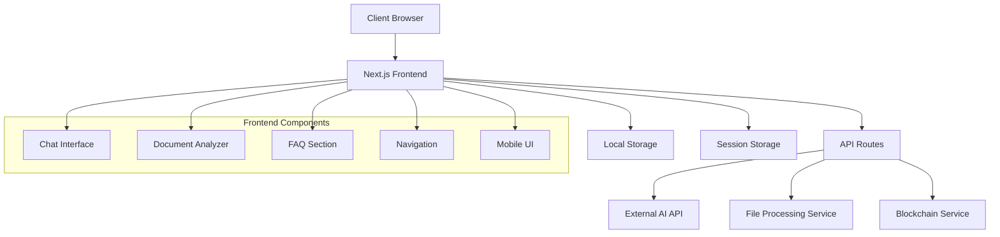

# Design Document

## Overview

LexMint is a modern, responsive AI-powered legal assistant web application built with Next.js 15, React 19, TypeScript, and Tailwind CSS. The application leverages shadcn/ui components with a custom mint green theme (#A4F9C8) to provide an intuitive and professional user experience. The system integrates with external AI APIs to deliver intelligent legal document analysis and question-answering capabilities across desktop and mobile platforms.

## Architecture

### High-Level Architecture



### Technology Stack

- **Frontend Framework**: Next.js 15 with App Router
- **UI Framework**: React 19 with TypeScript
- **Styling**: Tailwind CSS 4 with custom mint theme
- **Component Library**: shadcn/ui with Radix UI primitives
- **Icons**: Lucide React
- **State Management**: React hooks and context
- **File Processing**: Browser-based PDF parsing
- **API Integration**: Fetch API with error handling
- **Testing**: Vitest with Testing Library
- **Build Tool**: Turbopack for development

## Components and Interfaces

### Core Components

#### 1. Layout Components

**MainLayout** (`src/components/layout/MainLayout.tsx`)
- Responsive navigation header
- Mobile-friendly sidebar/drawer
- Footer with legal disclaimers
- Mint green theme integration

**Navigation** (`src/components/layout/Navigation.tsx`)
- Desktop: Horizontal navigation bar
- Mobile: Hamburger menu with slide-out drawer
- Active route highlighting
- Accessibility-compliant navigation

#### 2. Chat Interface Components

**ChatContainer** (`src/components/chat/ChatContainer.tsx`)
- Main chat interface wrapper
- Message history management
- Responsive layout adaptation

**MessageList** (`src/components/chat/MessageList.tsx`)
- Scrollable message history
- Message bubbles with user/AI distinction
- Citation display for AI responses
- Loading states and error handling

**ChatInput** (`src/components/chat/ChatInput.tsx`)
- Text input with send button
- Mobile: Sticky bottom positioning
- Character count and validation
- Auto-resize textarea functionality

**MessageBubble** (`src/components/chat/MessageBubble.tsx`)
- User and AI message styling
- Citation links and references
- Timestamp display
- Copy message functionality

#### 3. Document Analyzer Components

**DocumentUpload** (`src/components/upload/DocumentUpload.tsx`)
- Drag-and-drop file upload
- File type validation (PDF, DOC, DOCX)
- Progress indicators
- Error handling and retry mechanisms

**DocumentViewer** (`src/components/upload/DocumentViewer.tsx`)
- Document preview functionality
- Text extraction display
- Highlight key sections
- Mobile-optimized viewing

**AnalysisResults** (`src/components/upload/AnalysisResults.tsx`)
- AI analysis summary display
- Key clauses highlighting
- Issue identification
- Downloadable reports

#### 4. FAQ Components

**FAQContainer** (`src/components/faq/FAQContainer.tsx`)
- Categorized question display
- Search functionality
- Responsive grid layout

**FAQItem** (`src/components/faq/FAQItem.tsx`)
- Expandable question/answer pairs
- AI-generated content indicators
- Related questions suggestions

#### 5. UI Components (Enhanced shadcn/ui)

**Button** (`src/components/ui/button.tsx`)
- Mint theme variants
- Loading states
- Icon support
- Accessibility features

**Card** (`src/components/ui/card.tsx`)
- Mint-themed cards
- Soft shadows and rounded corners
- Responsive padding

**Input** (`src/components/ui/input.tsx`) - Already exists with mint variant
**Textarea** (`src/components/ui/textarea.tsx`) - Already exists with mint variant
**Badge** (`src/components/ui/badge.tsx`) - Already exists with mint variant

**Progress** (`src/components/ui/progress.tsx`)
- File upload progress
- Processing indicators
- Mint theme styling

**Dialog** (`src/components/ui/dialog.tsx`)
- Modal dialogs for confirmations
- Error message displays
- Mobile-responsive

### API Interfaces

#### External AI API Integration

**AIService** (`src/lib/services/ai-service.ts`)
```typescript
interface AIRequest {
  query: string;
  context?: string;
  type: 'chat' | 'document-analysis' | 'faq';
}

interface AIResponse {
  answer: string;
  citations?: Citation[];
  confidence: number;
  sources?: string[];
}

interface Citation {
  text: string;
  source: string;
  url?: string;
}
```

#### File Processing Interface

**DocumentProcessor** (`src/lib/services/document-processor.ts`)
```typescript
interface DocumentProcessingResult {
  text: string;
  metadata: DocumentMetadata;
  pages: number;
  wordCount: number;
}

interface DocumentMetadata {
  title?: string;
  author?: string;
  createdDate?: Date;
  fileSize: number;
  fileType: string;
}
```

#### Blockchain Integration Interface

**BlockchainService** (`src/lib/services/blockchain-service.ts`)
```typescript
interface AnonymizedQuery {
  queryHash: string;
  timestamp: Date;
  queryType: string;
  responseHash: string;
}

interface BlockchainTransaction {
  transactionId: string;
  blockNumber: number;
  status: 'pending' | 'confirmed' | 'failed';
}
```

## Data Models

### Core Data Types

```typescript
// User interaction models
interface ChatMessage {
  id: string;
  content: string;
  role: 'user' | 'assistant';
  timestamp: Date;
  citations?: Citation[];
  isLoading?: boolean;
}

interface ChatSession {
  id: string;
  messages: ChatMessage[];
  createdAt: Date;
  lastActivity: Date;
}

// Document models
interface UploadedDocument {
  id: string;
  filename: string;
  fileSize: number;
  fileType: string;
  uploadedAt: Date;
  processedText?: string;
  analysisResult?: DocumentAnalysis;
}

interface DocumentAnalysis {
  summary: string;
  keyClauses: KeyClause[];
  potentialIssues: Issue[];
  recommendations: string[];
  confidence: number;
}

interface KeyClause {
  text: string;
  type: 'liability' | 'termination' | 'payment' | 'confidentiality' | 'other';
  importance: 'high' | 'medium' | 'low';
  explanation: string;
}

interface Issue {
  description: string;
  severity: 'critical' | 'warning' | 'info';
  suggestion: string;
  location?: string;
}

// FAQ models
interface FAQItem {
  id: string;
  question: string;
  answer: string;
  category: string;
  isAIGenerated: boolean;
  lastUpdated: Date;
  popularity: number;
}

interface FAQCategory {
  id: string;
  name: string;
  description: string;
  items: FAQItem[];
}
```

### State Management

**Global State Structure**
```typescript
interface AppState {
  user: {
    preferences: UserPreferences;
    sessionId: string;
  };
  chat: {
    currentSession: ChatSession;
    history: ChatSession[];
  };
  documents: {
    uploaded: UploadedDocument[];
    currentAnalysis?: DocumentAnalysis;
  };
  ui: {
    theme: 'light' | 'dark';
    isMobile: boolean;
    isLoading: boolean;
    errors: AppError[];
  };
}

interface UserPreferences {
  saveToBlockchain: boolean;
  citationStyle: 'apa' | 'mla' | 'chicago';
  language: string;
}
```

## Error Handling

### Error Types and Handling Strategy

```typescript
interface AppError {
  id: string;
  type: 'api' | 'validation' | 'network' | 'file' | 'blockchain';
  message: string;
  details?: string;
  timestamp: Date;
  isRetryable: boolean;
}

// Error handling utilities
class ErrorHandler {
  static handleAPIError(error: APIError): AppError;
  static handleFileError(error: FileError): AppError;
  static handleNetworkError(error: NetworkError): AppError;
  static displayError(error: AppError): void;
  static retryOperation(operation: () => Promise<any>, maxRetries: number): Promise<any>;
}
```

### Error Recovery Mechanisms

1. **API Failures**: Automatic retry with exponential backoff
2. **File Upload Errors**: Clear error messages with retry options
3. **Network Issues**: Offline detection and graceful degradation
4. **Validation Errors**: Real-time feedback with correction suggestions
5. **Blockchain Failures**: Continue operation without blockchain features

## Testing Strategy

### Testing Approach

1. **Unit Tests**: Individual component and utility function testing
2. **Integration Tests**: API integration and service interaction testing
3. **E2E Tests**: Complete user workflow testing
4. **Accessibility Tests**: WCAG compliance verification
5. **Performance Tests**: Load time and responsiveness testing

### Test Structure

```typescript
// Component testing example
describe('ChatInput Component', () => {
  it('should send message on submit');
  it('should validate input length');
  it('should handle API errors gracefully');
  it('should be accessible via keyboard');
});

// Service testing example
describe('AIService', () => {
  it('should format requests correctly');
  it('should handle API responses');
  it('should retry failed requests');
  it('should parse citations properly');
});
```

### Testing Tools Configuration

- **Vitest**: Fast unit and integration testing
- **Testing Library**: Component testing utilities
- **MSW**: API mocking for tests
- **Axe**: Accessibility testing
- **Playwright**: E2E testing (future enhancement)

## Mobile Optimization

### Responsive Design Strategy

1. **Breakpoints**: 
   - Mobile: < 768px
   - Tablet: 768px - 1024px
   - Desktop: > 1024px

2. **Mobile-First Approach**: Base styles for mobile, enhanced for larger screens

3. **Touch Optimization**:
   - Minimum 44px touch targets
   - Swipe gestures for navigation
   - Pull-to-refresh functionality

4. **Performance Optimization**:
   - Lazy loading for non-critical components
   - Image optimization with Next.js
   - Code splitting by route

### Mobile-Specific Features

- **Sticky Chat Input**: Fixed bottom positioning for easy access
- **Gesture Navigation**: Swipe between sections
- **Offline Support**: Service worker for basic functionality
- **Progressive Web App**: Installable app experience

## Security Considerations

### Data Protection

1. **API Key Security**: Server-side API calls only
2. **Input Sanitization**: XSS prevention for all user inputs
3. **File Upload Security**: Type validation and size limits
4. **HTTPS Enforcement**: All communications encrypted
5. **Content Security Policy**: Strict CSP headers

### Privacy Features

1. **Data Anonymization**: Remove PII before blockchain storage
2. **Local Storage**: Sensitive data stored locally only
3. **Session Management**: Secure session handling
4. **Audit Logging**: Track data access and modifications

## Performance Optimization

### Frontend Performance

1. **Code Splitting**: Route-based and component-based splitting
2. **Image Optimization**: Next.js Image component with WebP support
3. **Caching Strategy**: Browser caching for static assets
4. **Bundle Analysis**: Regular bundle size monitoring
5. **Lazy Loading**: Defer non-critical component loading

### API Performance

1. **Request Debouncing**: Prevent excessive API calls
2. **Response Caching**: Cache frequently requested data
3. **Compression**: Gzip compression for API responses
4. **Rate Limiting**: Client-side rate limiting implementation

## Deployment and Infrastructure

### Build Configuration

- **Next.js Build**: Optimized production builds
- **Static Generation**: Pre-render static pages where possible
- **Environment Variables**: Secure configuration management
- **Asset Optimization**: Automatic asset optimization

### Monitoring and Analytics

1. **Error Tracking**: Real-time error monitoring
2. **Performance Metrics**: Core Web Vitals tracking
3. **User Analytics**: Privacy-compliant usage analytics
4. **API Monitoring**: Response time and error rate tracking